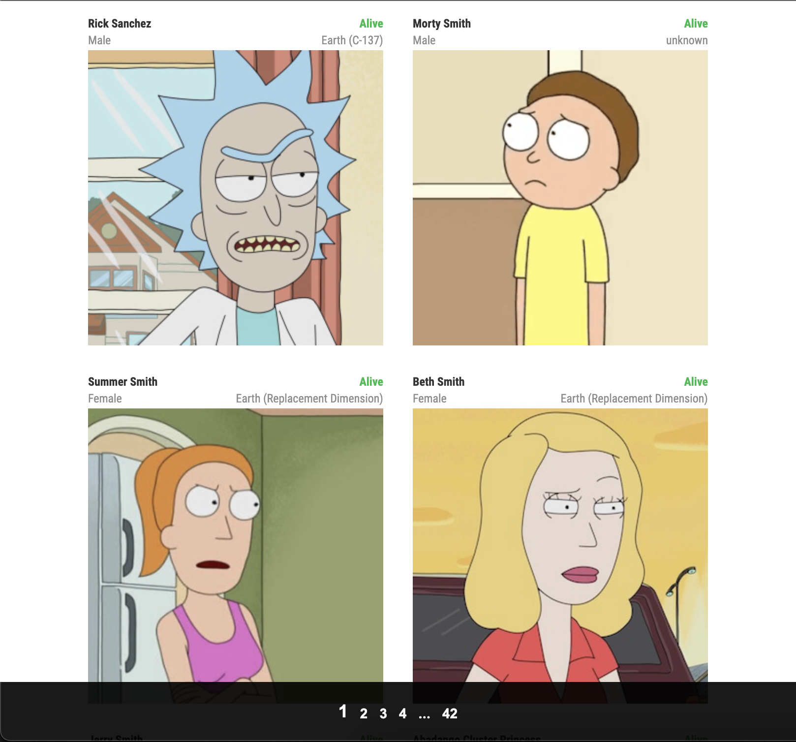

# vue-client

## The app is an interface for checking info about characters from Rick and Morty

<p align="center">
</p>

## Paginator is a main functional part of an app

<p align="center">
</p>

## App has amobile layout

<p align="center">
</p>

### All the data is taken from an API: [https://rickandmortyapi.com/api/](https://rickandmortyapi.com/api/)

## Project setup

```bash
npm install
```

### Compiles and hot-reloads for development

```bash
npm run serve
```

### Compiles and minifies for production

```bash
npm run build
```
